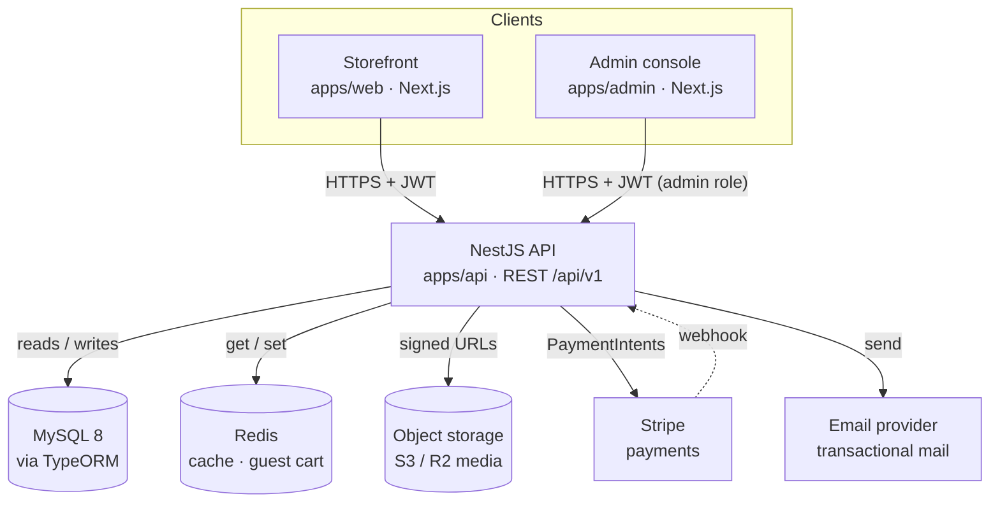
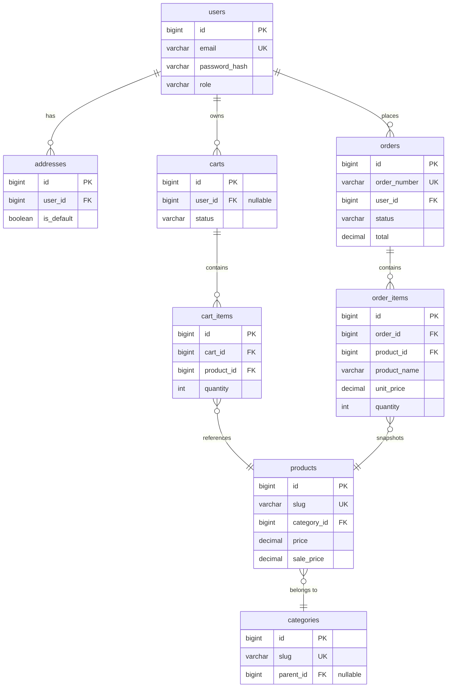
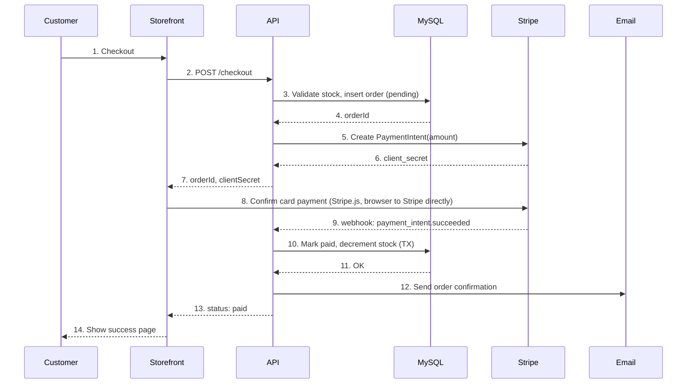

# GiftBuddy — Backend & Admin Panel Analysis

**End-to-end technical specification for the NestJS + MySQL backend and admin console**

The Next.js storefront built so far is a UI-only shell over in-memory mock data. This document
specifies everything needed to back it with a real system: a NestJS API, a MySQL database, and an
admin console — covering data model, endpoints, auth, integrations, and a phased build order.
It is a planning artifact only; no application code changes are included here.

| | |
|---|---|
| **Prepared** | Aug 12, 2026 |
| **Companion to** | `apps/web` storefront |
| **Backend** | NestJS 10 · TypeScript |
| **Database** | MySQL 8 |
| **Status** | Analysis — no code yet |
| **Stack** | NestJS · MySQL 8 · TypeORM · Redis · Stripe · JWT |

## Contents

1. [Scope & current state](#01-scope--current-state)
2. [Target architecture](#02-target-architecture)
3. [Data model & schema](#03-data-model--schema)
4. [API design](#04-api-design)
5. [Auth & authorization](#05-auth--authorization)
6. [Core business flows](#06-core-business-flows)
7. [Admin panel specification](#07-admin-panel-specification)
8. [Third-party integrations](#08-third-party-integrations)
9. [Non-functional requirements](#09-non-functional-requirements)
10. [DevOps & environments](#10-devops--environments)
11. [Frontend integration plan](#11-frontend-integration-plan)
12. [Delivery roadmap](#12-delivery-roadmap)
13. [Open decisions](#13-open-decisions)

---

## 01. Scope & current state

What exists today, what's missing, and what this document is for.

### What's built

- A Next.js 16 (App Router) storefront: home, shop with filters, product detail, cart, checkout, account, wishlist, blog, contact, about, FAQ, track-orders.
- All content is hard-coded in `src/lib/data.ts` against the types in `src/lib/types.ts` (`Product`, `Category`, `BlogPost`, `Testimonial`).
- Cart and wishlist state live in a client-side React context (`CartContext`) — in memory only, lost on refresh, never sent anywhere.
- Every form (login, register, checkout, contact, newsletter, track order) calls `preventDefault()` and does nothing else.

### What's missing

- Persistence — a database and an API in front of it.
- Real identity — customer accounts, sessions, password reset, and a separate admin identity with roles.
- Commerce logic — stock-aware carts, order creation, payment capture, coupons, shipping/tax.
- Content management — someone other than a developer needs to add products, edit the blog, and answer contact messages.
- Operational tooling — an admin console to run the store day to day.

### What this document is

An implementation-ready specification: the database schema, the REST contract, the auth model,
the admin feature set, the integrations, and the order in which to build it. It intentionally stops
short of code — the next step after sign-off is scaffolding `apps/api` against Sections 03–05.

---

## 02. Target architecture

Two Next.js frontends talk to one NestJS API; the API owns every downstream dependency.

*Fig. 1 — Both frontends are pure API clients; the NestJS API is the single boundary that holds
credentials for MySQL, Redis, storage, Stripe, and email. Stripe calls back through a signed
webhook rather than the API polling it.*

### Why NestJS

- Module-per-domain structure maps directly onto Section 03's table groups (catalog, commerce, identity, content) — each becomes a Nest module with its own controller/service/repository.
- Guards, pipes, and interceptors give first-class request validation (`class-validator` DTOs) and auth enforcement without hand-rolled middleware.
- TypeScript end-to-end: DTOs and response shapes can be shared as a `packages/types` package with both Next.js apps.

### Why MySQL

- Orders, payments, and stock decrements need real transactions and foreign-key integrity — a relational store is the right default for commerce data, not a document store.
- Wide hosting choice (RDS, Cloud SQL, PlanetScale, self-managed) and mature TypeORM support.

### Proposed monorepo layout

| Path | Contents |
|---|---|
| `apps/web` | Existing storefront (current repo root moves here) |
| `apps/admin` | New admin console — Next.js, same design tokens, data-dense layouts |
| `apps/api` | New NestJS backend — REST API, TypeORM, migrations, workers |
| `packages/types` | Shared TS types/DTOs (Product, Order, Category, …) consumed by all three apps |
| `packages/config` | Shared ESLint/TS/Tailwind config |

---

## 03. Data model & schema

MySQL 8, InnoDB, one schema. Grouped by domain; full column detail follows the diagram.

*Fig. 2 — Core commerce mechanism: a cart accumulates `cart_items` against products, and at
checkout its contents are copied into an immutable `order_items` snapshot on a new order. Full
table list (identity, catalog, commerce, engagement, content, system) is below.*

> **Order line items are a snapshot, not a live join.** `order_items` stores `product_name`,
> `unit_price`, and `sku` at time of purchase, independent of `product_id`. If a product's price
> or name changes later, past invoices must not change.

### Identity

| Table | Key columns | Notes |
|---|---|---|
| `users` | `id, email UNIQUE, password_hash, first_name, last_name, phone, email_verified_at, created_at` | Customers only. `password_hash` null for future OAuth users. |
| `addresses` | `id, user_id FK, label, line1, line2, city, region, postal_code, country, is_default` | Many per user; one flagged default. |
| `admin_users` | `id, email UNIQUE, password_hash, name, role_id FK, is_active, last_login_at` | Kept separate from `users` — different login surface and password policy. |
| `roles` | `id, name UNIQUE, description` | Super Admin, Catalog Manager, Support Agent, Content Editor (seeded). |
| `permissions` | `id, key UNIQUE` | e.g. `products.write`, `orders.refund` — see Section 05. |
| `role_permissions` | `role_id FK, permission_id FK` | Composite PK; join table. |

### Catalog

| Table | Key columns | Notes |
|---|---|---|
| `categories` | `id, slug UNIQUE, name, image_asset_id FK, parent_id FK null, sort_order` | `parent_id` allows sub-categories later; MVP keeps it flat. |
| `products` | `id, slug UNIQUE, sku UNIQUE, name, description, price, sale_price null, category_id FK, rating_avg, rating_count, stock_qty, is_featured, is_active, created_at` | `rating_avg`/`rating_count` denormalized from `reviews`, recalculated on write. |
| `product_images` | `id, product_id FK, asset_id FK, sort_order, is_primary` | Replaces the `image`/`image2`/`gallery[]` fields with an ordered set. |
| `product_tags` | `product_id FK, tag` | Free-text tags for filtering/search (e.g. "personalised"). |

### Commerce

| Table | Key columns | Notes |
|---|---|---|
| `carts` | `id, user_id FK null, session_token UNIQUE null, status(active/merged/converted), currency` | Guest carts key off `session_token` cookie; merged into user cart on login. |
| `cart_items` | `id, cart_id FK, product_id FK, quantity, UNIQUE(cart_id, product_id)` | Price is *not* stored here — always read live from `products`. |
| `orders` | `id, order_number UNIQUE, user_id FK, status, subtotal, shipping_total, tax_total, discount_total, total, currency, shipping_address_id FK, billing_address_id FK, placed_at` | `status`: `pending_payment → paid → fulfilled → completed`, or `cancelled`/`refunded`. |
| `order_items` | `id, order_id FK, product_id FK, product_name, sku, unit_price, quantity, line_total` | Immutable snapshot — see callout above. |
| `order_status_history` | `id, order_id FK, from_status, to_status, note, changed_by_admin_id FK null, created_at` | Audit trail admins see on the order detail screen. |
| `payments` | `id, order_id FK, provider, provider_ref UNIQUE, amount, status, raw_payload JSON, created_at` | One row per PaymentIntent/attempt; `provider_ref` makes webhooks idempotent. |
| `coupons` | `id, code UNIQUE, type(percent/fixed), value, min_subtotal, starts_at, expires_at, usage_limit, times_used` | |
| `shipping_methods` | `id, name, price, free_over_amount null, is_active` | Flat-rate MVP; matches header banner "Free shipping over $99". |

### Engagement

| Table | Key columns | Notes |
|---|---|---|
| `reviews` | `id, product_id FK, user_id FK, rating(1-5), title, body, is_approved, created_at` | Storefront's static testimonials become `is_featured` reviews chosen by an admin. |
| `wishlists` | `id, user_id FK UNIQUE` | One per user. |
| `wishlist_items` | `wishlist_id FK, product_id FK, added_at` | Composite PK. |
| `newsletter_subscribers` | `id, email UNIQUE, subscribed_at, unsubscribed_at null` | Footer + home "Newsletter Sign-Up" form. |
| `contact_messages` | `id, name, email, subject, message, status(new/read/replied), created_at` | Contact page submissions; visible in admin inbox. |

### Content & system

| Table | Key columns | Notes |
|---|---|---|
| `blog_posts` | `id, slug UNIQUE, title, excerpt, content, cover_asset_id FK, author_admin_id FK, status(draft/published), published_at` | |
| `faqs` | `id, group(shipping/returns/orders), question, answer, sort_order` | Backs the FAQ accordion groups already in the UI. |
| `media_assets` | `id, url, provider(s3), width, height, alt_text, uploaded_by_admin_id FK, created_at` | Single table backing product images, category images, blog covers. |
| `settings` | `key UNIQUE, value JSON` | Store name, support email/phone, tax rate, social links — editable in admin, no redeploy. |
| `audit_logs` | `id, admin_id FK, action, entity, entity_id, diff JSON, created_at` | Who changed what, for every admin write. |

### Mapping today's mock data to the schema

| `lib/types.ts` | Field | Becomes |
|---|---|---|
| `Product` | `image / image2 / gallery[]` | Rows in `product_images`, ordered by `sort_order` |
| `Product` | `badge: "sale"\|"new"\|"hot"` | Computed, not stored: `sale` = `sale_price` present · `new` = `created_at` within 30 days · `hot` = `is_featured` flag |
| `Product` | `rating / reviews` | `products.rating_avg / rating_count`, denormalized from `reviews` |
| `Product` | `category: string` | `products.category_id → categories.slug` |
| `Testimonial` | whole type | A `reviews` row with `is_featured = true`, joined to the author's name |
| `giftKits` (home page) | whole array | MVP: a `product_tags` value (e.g. `kit:for-him`) filtered at query time; no new table needed |

---

## 04. API design

REST under `/api/v1`. JSON in, JSON out, cursor-free pagination, one error shape.

### Conventions

- List endpoints accept `?page=1&limit=20&sort=price:asc&category=home-living&minRating=4&maxPrice=200` — the same filters the Shop page already models client-side.
- List responses: `{ data: T[], meta: { page, limit, total, totalPages } }`.
- Errors: `{ statusCode, error, message, fields?: { field: reason } }` — `fields` populated on 422 validation failures from `class-validator`.
- Auth via `Authorization: Bearer <access_token>`; refresh token in an `httpOnly` cookie (see Section 05).
- Idempotency: mutating endpoints that touch payment or stock accept an `Idempotency-Key` header.

### Public / storefront

| Method | Path | Auth | Purpose |
|---|---|---|---|
| POST | `/auth/register` | — | Create account, send verification email |
| POST | `/auth/login` | — | Issue access + refresh token |
| POST | `/auth/refresh` | Refresh cookie | Rotate access token |
| POST | `/auth/logout` | User | Revoke refresh token |
| POST | `/auth/forgot-password` | — | Send reset link |
| POST | `/auth/reset-password` | Reset token | Set new password |
| GET | `/me` | User | Current profile |
| PATCH | `/me` | User | Update name/phone |
| GET / POST | `/me/addresses` | User | List / add address |
| PATCH / DELETE | `/me/addresses/:id` | User | Update / remove address |
| GET | `/categories` | — | Category strip + shop sidebar counts |
| GET | `/products` | — | Filtered/sorted/paginated catalog (Shop page) |
| GET | `/products/:slug` | — | Product detail + gallery |
| GET | `/products/:slug/related` | — | Related-products rail |
| GET | `/products/featured` | — | Home page "Top Holiday Gift Ideas" |
| GET | `/products/:slug/reviews` | — | Reviews tab |
| POST | `/products/:slug/reviews` | User | Submit review (goes to `is_approved=false`) |
| GET | `/cart` | User or guest cookie | Current cart with live prices |
| POST | `/cart/items` | User or guest | Add item |
| PATCH / DELETE | `/cart/items/:productId` | User or guest | Change quantity / remove |
| POST | `/cart/coupon` | User or guest | Apply coupon code |
| GET | `/wishlist` | User | Wishlist page |
| POST / DELETE | `/wishlist/items/:productId` | User | Toggle from a product card |
| POST | `/checkout` | User or guest | Validate stock, create `order` + Stripe PaymentIntent |
| POST | `/webhooks/stripe` | Stripe signature | Confirm payment, mark order paid, decrement stock |
| GET | `/orders` | User | Order history |
| GET | `/orders/:orderNumber` | User | Order detail |
| POST | `/orders/track` | — | Guest lookup by `{ orderNumber, email }` |
| GET | `/blog` | — | Blog list |
| GET | `/blog/:slug` | — | Blog post + "more articles" |
| GET | `/faqs` | — | Grouped FAQ accordion |
| POST | `/contact` | — | Contact form → `contact_messages` + ack email |
| POST | `/newsletter` | — | Footer + home newsletter form |

### Admin (all under `/admin`, all require an admin JWT)

| Method | Path | Permission | Purpose |
|---|---|---|---|
| POST | `/admin/auth/login` | — | Separate login surface from customers |
| GET | `/admin/dashboard` | `dashboard.read` | Revenue, order count, AOV, low-stock widgets |
| CRUD | `/admin/products`, `/admin/products/:id` | `products.read` / `.write` | Catalog management incl. image upload |
| CRUD | `/admin/categories` | `products.write` | Category management |
| GET | `/admin/orders` | `orders.read` | Filterable order queue |
| GET | `/admin/orders/:id` | `orders.read` | Order detail, timeline, payment |
| PATCH | `/admin/orders/:id/status` | `orders.write` | Advance fulfillment status, notifies customer |
| POST | `/admin/orders/:id/refund` | `orders.refund` | Issue Stripe refund |
| GET | `/admin/customers`, `/:id` | `customers.read` | Customer list + order history |
| CRUD | `/admin/coupons` | `marketing.write` | Discount codes |
| PATCH | `/admin/reviews/:id` | `reviews.moderate` | Approve/reject/feature a review |
| CRUD | `/admin/blog` | `content.write` | Blog post editor, draft/publish |
| CRUD | `/admin/faqs` | `content.write` | FAQ entries |
| GET | `/admin/contact-messages` | `content.read` | Inbox for the Contact form |
| POST | `/admin/media` | `media.write` | Signed upload → `media_assets` row |
| GET / PATCH | `/admin/settings` | `settings.write` | Store info, shipping, tax, SMTP, payment keys |
| CRUD | `/admin/roles` | `roles.write` | Role → permission assignment |
| GET | `/admin/audit-logs` | `roles.write` | Who changed what, when |

---

## 05. Auth & authorization

Two identity surfaces that never share a login page, a token, or a database role.

### Customers

- Email + password, hashed with **argon2**. Access token: JWT, 15 min TTL, sent in the response body. Refresh token: opaque, 30 days, stored hashed in a `users`-linked table, delivered as an `httpOnly`, `Secure`, `SameSite=Lax` cookie.
- Guest checkout is supported: a `cart.session_token` cookie identifies an anonymous cart; on login/register that cart is merged into the user's cart (union quantities, prefer the higher quantity per product).
- Password reset and email verification both use single-use, short-lived signed tokens emailed as links.

### Admins

- `admin_users` is a separate table with its own login endpoint, its own JWT (different signing secret and audience claim), and mandatory TOTP 2FA before General Availability — flagged as a fast-follow, not MVP-blocking.
- Every admin JWT carries the resolved permission set at issue time; the `PermissionsGuard` checks it against a `@RequirePermissions('orders.write')` decorator on each route — no per-request DB hit.

### Role → permission matrix (seed data)

| Permission | Super Admin | Catalog Mgr | Support Agent | Content Editor |
|---|:---:|:---:|:---:|:---:|
| `dashboard.read` | ✓ | ✓ | ✓ | ✓ |
| `products.read` / `.write` | ✓ | ✓ | – | – |
| `orders.read` / `.write` | ✓ | – | ✓ | – |
| `orders.refund` | ✓ | – | – | – |
| `customers.read` | ✓ | – | ✓ | – |
| `marketing.write` (coupons) | ✓ | ✓ | – | – |
| `reviews.moderate` | ✓ | ✓ | – | – |
| `content.read` / `.write` (blog, FAQ, contact inbox) | ✓ | – | – | ✓ |
| `media.write` | ✓ | ✓ | – | ✓ |
| `settings.write` | ✓ | – | – | – |
| `roles.write` | ✓ | – | – | – |

---

## 06. Core business flows

The one sequence worth drawing in full: cart → order → paid → fulfilled.

*Fig. 3 — Order creation and payment confirmation are deliberately decoupled: the API creates a
`pending_payment` order before the browser ever touches Stripe, and only the webhook (step 9),
never the browser, is trusted to flip it to `paid`. Stock is decremented in the same transaction as
the status update, so a duplicate webhook (Stripe retries) can't double-decrement — the handler is
keyed on `payments.provider_ref`.*

### Other flows worth naming (not diagrammed)

- **Admin fulfillment:** admin moves an order `paid → fulfilled → completed` from the order detail screen; each transition writes `order_status_history` and fires a status-update email.
- **Refund:** admin-initiated only. Creates a Stripe refund, writes a new `payments` row with `status=refunded`, sets `orders.status=refunded`, restocks the items.
- **Guest cart merge:** on login, cart items from the `session_token` cart are upserted into the user's cart by `product_id`, then the guest cart is deleted.

---

## 07. Admin panel specification

A second Next.js app, same design tokens, denser layout — built for scanning, not browsing.

`apps/admin` reuses the storefront's rose/peach palette and Jost type so both feel like one
product, but the layout follows dashboard conventions: a fixed left nav, data tables with inline
actions, and forms optimized for keyboard entry rather than the storefront's card-heavy browsing
UI. It authenticates against `/admin/auth/login` and every screen maps to a permission from
Section 05's matrix — a Support Agent simply doesn't see the Settings or Catalog nav items.

### Modules

| Module | Key screens | Requires |
|---|---|---|
| Dashboard | Revenue & order sparklines, AOV, low-stock list, recent orders, new contact messages | `dashboard.read` |
| Catalog | Product list (search/filter), product editor (info, pricing, images, stock, SEO), category tree editor | `products.*` |
| Orders | Order queue with status filter, order detail (items, timeline, payment, refund), CSV export | `orders.*` |
| Customers | Customer list, detail with address book and order history | `customers.read` |
| Marketing | Coupon list/editor with usage stats | `marketing.write` |
| Reviews | Moderation queue (approve/reject), feature toggle for homepage testimonials | `reviews.moderate` |
| Content | Blog editor (draft/publish, cover image), FAQ list editor, Contact inbox | `content.*` |
| Media library | Upload, browse, search assets by usage (product/blog/category) | `media.write` |
| Settings | Store info, shipping rate, tax rate, SMTP, Stripe keys, social links | `settings.write` |
| Team & roles | Invite admin, assign role, edit role → permission grants, audit log viewer | `roles.write` |

> **Product editor is the highest-leverage screen.** It's the one non-engineer-facing form that
> directly determines what the storefront looks like — it should support drag-to-reorder gallery
> images, live sale-price preview, and a stock-qty stepper with a "mark out of stock" shortcut,
> since those map straight onto `ProductCard`'s badge and "Sold Out" states already built in the
> storefront.

---

## 08. Third-party integrations

Four external dependencies, each owned exclusively by the API.

| Concern | Choice | Why / alternative |
|---|---|---|
| Payments | Stripe (PaymentIntents + webhooks) | Best-documented webhook model for the flow in Fig. 3. Alt: PayPal, as a second method post-MVP. |
| Transactional email | Resend or SES | Order confirmation, shipping update, password reset, contact ack, newsletter welcome. Templates rendered server-side (React Email or MJML). |
| Object storage | S3-compatible (AWS S3 or Cloudflare R2) | API issues short-lived signed upload URLs so the admin panel uploads directly, not proxied through Nest. |
| Search | MySQL `FULLTEXT` index on `products.name/description` for MVP | Swap for Meilisearch/Algolia only if catalog size or query complexity outgrows it — avoid the extra service until there's evidence it's needed. |
| Tax | Single flat `settings.tax_rate` for MVP | Region-aware tax (Stripe Tax / TaxJar) is a fast-follow, not a launch blocker. |
| Error tracking | Sentry (API + both frontends) | Shared project, environment-tagged. |

---

## 09. Non-functional requirements

The parts that don't show up in a feature demo but decide whether this survives launch day.

### Security

- All DTOs validated with `class-validator` at the controller boundary; TypeORM parameterizes every query, no raw string interpolation.
- Passwords hashed with argon2; refresh tokens stored hashed, never in plaintext.
- `helmet`, strict CORS allowlist (storefront + admin origins only), and `@nestjs/throttler` rate limiting on `/auth/*` and `/checkout`.
- Uploaded files validated by MIME + magic-byte sniffing and re-encoded, not trusted by extension.
- Admin 2FA (TOTP) before GA; all admin writes captured in `audit_logs`.

### Performance

- Redis caches category lists and product-list queries (short TTL, invalidated on admin write) — the highest-traffic, least-personalized reads.
- Indexes on every FK, plus `products.slug`, `products.sku`, `orders.order_number`, `orders.user_id`.
- Images served through a CDN in front of object storage; Next.js `<Image>` already does responsive sizing on the frontend.

### Reliability

- Order creation and stock decrement always run inside a single DB transaction — never two round trips that can partially fail.
- Stripe webhook handler is idempotent, keyed on `payments.provider_ref`, safe against Stripe's at-least-once retry policy.

### Observability & testing

- Structured JSON logs (pino) with request-id correlation across API and both frontends.
- Sentry for uncaught exceptions; uptime checks on `/health`.
- Unit tests per service, integration tests per controller against a real MySQL test container, e2e (Supertest) for auth, checkout, and admin-order-status happy paths.

---

## 10. DevOps & environments

Docker Compose locally, migrations in CI, seeded data from the existing mock catalog.

- **Local dev:** `docker-compose.yml` with `mysql`, `redis`, `mailhog` (catches transactional email locally), and the Nest API with hot reload.
- **Migrations:** TypeORM migrations, one per schema change, run automatically in CI against a throwaway MySQL container before merge.
- **Seed data:** a seed script reads today's `src/lib/data.ts` shape and inserts it as real rows — the storefront's current mock catalog becomes the first admin-editable catalog, not thrown away.
- **CI:** lint + typecheck + unit/integration tests + migration dry-run on every PR across all three apps.

### Environment variables (API)

| Variable | Purpose |
|---|---|
| `DATABASE_URL` | MySQL connection string |
| `REDIS_URL` | Cache / guest-cart store |
| `JWT_ACCESS_SECRET` / `JWT_REFRESH_SECRET` | Customer token signing |
| `ADMIN_JWT_SECRET` | Separate signing key for admin tokens |
| `STRIPE_SECRET_KEY` / `STRIPE_WEBHOOK_SECRET` | Payments |
| `S3_BUCKET`, `S3_REGION`, `S3_ACCESS_KEY`, `S3_SECRET_KEY` | Media storage |
| `EMAIL_PROVIDER_API_KEY` | Transactional email |
| `SENTRY_DSN` | Error tracking |
| `CORS_ORIGINS` | Comma-separated storefront + admin URLs |

---

## 11. Frontend integration plan

Every existing page, mapped to the endpoints it will call once the mock data comes out.

| Page | Endpoints |
|---|---|
| Home | `GET /categories`, `GET /products/featured`, `GET /blog?limit=3`, `GET /products/reviews/featured` |
| Shop | `GET /categories`, `GET /products?category&maxPrice&minRating&sort&page` |
| Product detail | `GET /products/:slug`, `GET /products/:slug/related`, `GET /products/:slug/reviews` |
| Header / Cart drawer | `GET /cart`, `POST /cart/items`, `PATCH/DELETE /cart/items/:id` (every mutation, not just page load) |
| Cart page | Same as above + `POST /cart/coupon` |
| Checkout | `GET /me/addresses`, `POST /checkout`, Stripe.js confirm, poll/subscribe `GET /orders/:orderNumber` |
| Account (sign in / register) | `POST /auth/login`, `POST /auth/register`, `POST /auth/forgot-password` |
| Wishlist | `GET /wishlist`, `POST/DELETE /wishlist/items/:id` |
| Blog list / post | `GET /blog`, `GET /blog/:slug` |
| Contact | `POST /contact` |
| FAQ | `GET /faqs` |
| Track Orders | `POST /orders/track` |
| Footer newsletter | `POST /newsletter` |

> **`CartContext` changes shape, not purpose.** It keeps the same public API (`addToCart`,
> `updateQuantity`, `itemCount`, …) so components don't change, but its internals switch from
> local `useState` to React Query/SWR calls against `/cart`, with a `cart_session` cookie carrying
> guest identity until login.

---

## 12. Delivery roadmap

Six phases, each shippable — the storefront goes live on real data at the end of Phase 1, not Phase 6.

### Phase 0 — Infra & scaffolding

Stand up the monorepo and empty services so every later phase has somewhere to land.

- Move storefront to `apps/web`; scaffold `apps/api` (NestJS) and `apps/admin`
- Docker Compose for MySQL + Redis + Mailhog; TypeORM configured with migrations
- CI pipeline: lint, typecheck, test, migration dry-run

### Phase 1 — Identity & catalog (read path)

The storefront starts reading real data instead of `lib/data.ts`.

- Tables: `users, addresses, categories, products, product_images, media_assets`
- Endpoints: auth (register/login/refresh), categories, products list/detail/related
- Seed script imports today's mock catalog as real rows

### Phase 2 — Cart, checkout & payments

The commercial core: money changes hands and stock moves.

- Tables: `carts, cart_items, orders, order_items, payments, order_status_history, shipping_methods`
- Endpoints: cart CRUD, `/checkout`, Stripe webhook, order history, order tracking
- Exit criteria: a real card can be charged in Stripe test mode end to end (Fig. 3)

### Phase 3 — Admin panel core

`apps/admin` goes from empty to operable for day-one store ops.

- Admin auth, roles/permissions, dashboard, product & category CRUD, order queue + status updates
- Exit criteria: a non-engineer can add a product and fulfill an order without touching the database

### Phase 4 — Engagement & content

Everything that makes the storefront feel alive rather than static.

- Tables: `reviews, wishlists, coupons, blog_posts, faqs, contact_messages, newsletter_subscribers`
- Admin: coupon editor, review moderation, blog editor, contact inbox

### Phase 5 — Hardening & launch

The unglamorous work that decides whether Phase 0–4 survives real traffic.

- Rate limiting, 2FA for admin, audit log, load test on `/products` and `/checkout`
- Sentry + uptime monitoring wired in prod; backup/restore drill on MySQL

---

## 13. Open decisions

Five calls that change the schema or scope enough to need a decision before Phase 0 starts.

**ORM: TypeORM vs. Prisma** — *Recommend TypeORM.*
TypeORM's decorator-based entities and DI integration are the idiomatic Nest choice and keep
entities colocated with Nest modules. Prisma's schema/migration DX is arguably better, but its
generated client sits awkwardly with Nest's DI container. Revisit only if the team has strong prior
Prisma experience.

**Guest checkout** — *Needs input.*
This document assumes guest checkout is allowed (matches "Track Orders" already in the UI). If
accounts become mandatory, `carts.session_token` and the `/orders/track` endpoint both drop out.

**Product variants (size/color)** — *Needs input.*
Current schema treats each product as a single SKU — matches today's UI exactly. Real variant
support (a size/color matrix with its own stock and price per combination) is a schema-level change
(`product_variants` + `variant_options`) best scoped once it's clear which categories actually need
it.

**Multi-currency / i18n** — *Deferred.*
Schema carries a `currency` column on `carts`/`orders` so it isn't foreclosed, but single-currency
(USD) is assumed through Phase 5. The header's language switcher in the original theme is treated
as decorative for now.

**Hosting target** — *Needs input.*
Affects concrete choices in Section 08/10 — e.g. PlanetScale (MySQL-compatible, branching) vs. RDS,
Cloudflare R2 vs. S3. Architecture in Section 02 is host-agnostic; this only changes environment
values, not the design.

---

*GiftBuddy — Backend & Admin Panel Analysis · Prepared Aug 12, 2026 · Analysis only, no application code changed.*
